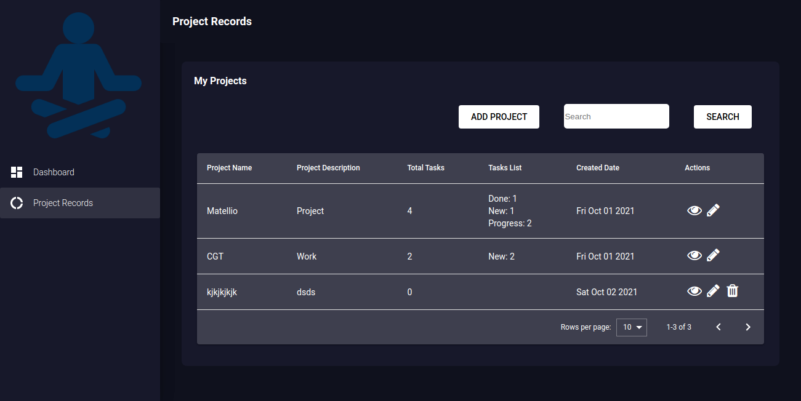
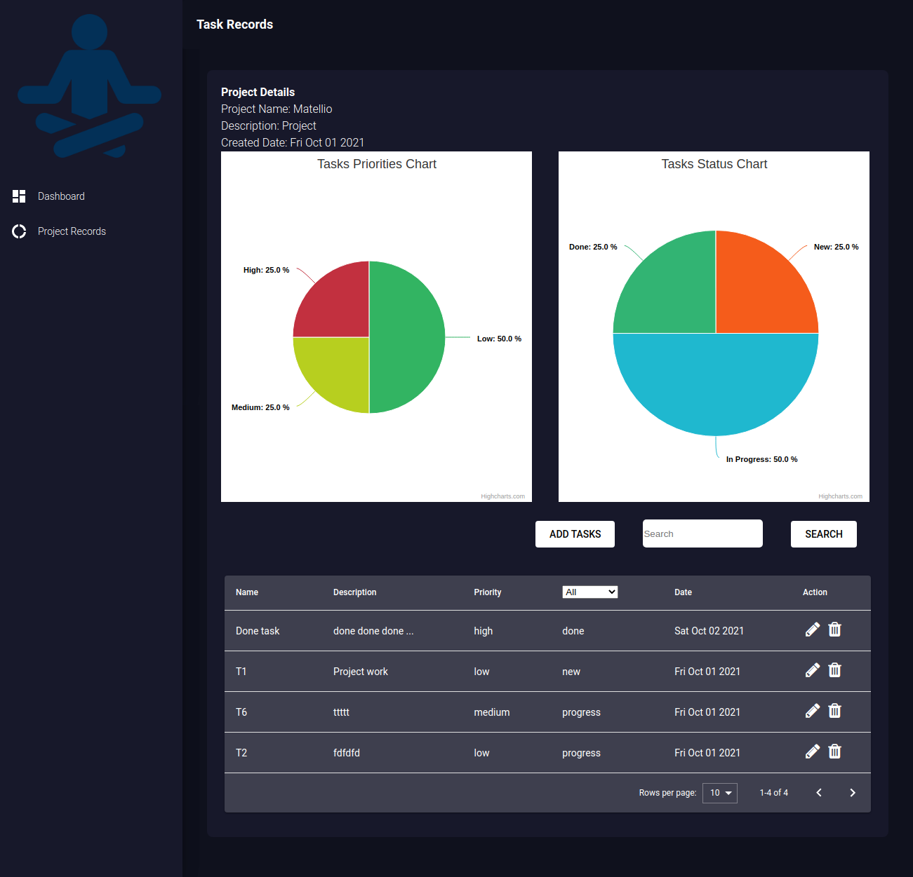

# managertasks
To manage manager tasks and view reports using react application

This is a open project to manage project managers to manage project wise tasks.

# Features
1. React js application
2. Redux for storage
3. Persisted storage
4. UI and theme
5. Material theme and components
6. Responsive for tabs, laptops and pcs
7. Dashboard graphs
   1. Status wise graph
   2. Priority wise graph
8. Project Manage
   1. Create project
   2. Edit projects
   3. Delete projects
   4. Project listing with pagination
   5. Search projects by name or description
   6. View details and add tasks
9. Tasks Manage
   1. Project information
   2. Pie charts for tasks
      1. Status wise graph
      2. Priority wise graph
   3. Create task
   4. Edit tasks
   5. Delete tasks
   6. Task listing with pagination
   7. Search tasks by name or description
   8. Filter tasks by status

# Stacks:
"react": 16.8.6,
"node": 12.22.4,
"npm": 6.14.14,
"react-scripts": "3.0.1",
"redux": "^4.0.5",
"@amcharts/amcharts4": "^4.10.7",
"@date-io/date-fns": "^1.3.11",
"@material-ui/core": "4.1.0",
"@material-ui/icons": "4.1.0",
"@material-ui/pickers": "^3.2.6",

other libraries
highcharts, react-notifications, classnames

# Setup and run
1. run `npm install`
2. run `npm start`
3. open browser and paste `http://localhost:3000`

# Below are images of project
# Dashboard

# Projects and manage project

# Tasks and manage tasks

